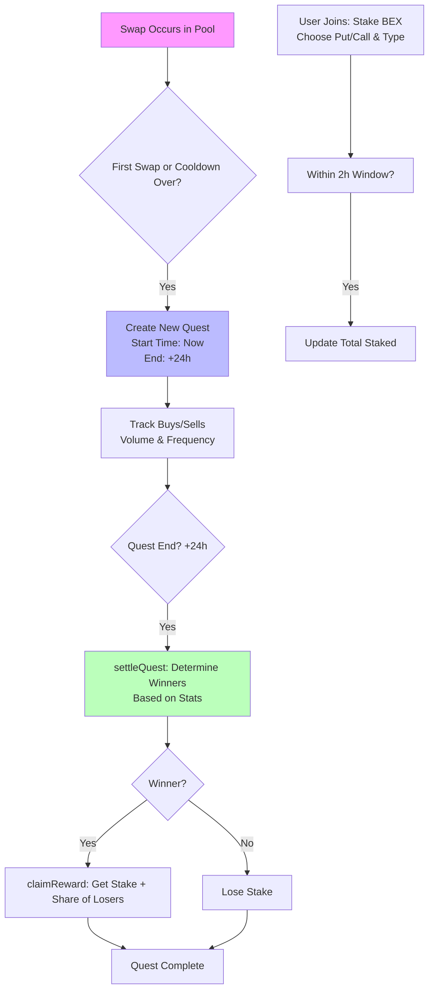

# SwapArena: Uniswap V4 Hook for Trading Quests

## Overview

SwapArena is a smart contract built as a hook for Uniswap V4 pools. It transforms everyday token swaps into competitive "quests" or prediction markets. Users can stake tokens (BEX coin) on whether buying or selling activity will dominate in a pool over a 24-hour period—either by **volume** (total value traded) or **frequency** (number of trades).

- **Core Idea**: Every swap in a hooked pool contributes to quest statistics. After each quest ends, winners (those who correctly predicted the dominant side) share the stakes from losers, minus a 10% fee.
- **Why?** It gamifies DeFi trading, encouraging participation and liquidity while rewarding accurate market predictions.
- **Tech Stack**: 
  - Solidity ^0.8.24
  - Uniswap V4 Core & Periphery (hooks implementation)
  - OpenZeppelin (ERC20, Ownable, SafeERC20)
  - Foundry for testing and deployment
- **Network**: Deployed on Base Sepolia (Chain ID: 84532) for testing.
- **Contract Address**: `0xc62a2207d15dc7946e80694311767ae13d588040`
- **BEX Coin Address** (set via `setToken`): Must be configured post-deployment (e.g., via admin).

## Key Features

- **Automatic Quest Creation**: Quests start every 24 hours (or on first swap), with a 1-hour cooldown between quests and a 2-hour join window.
- **Stake Types**:
  - **Put (Buy)**: Bet buys will exceed sells.
  - **Call (Sell)**: Bet sells will exceed buys.
  - **Quest Types**: VOLUME (total trade value) or FREQUENCY (trade count).
- **Rewards**: Winners get their stake back + proportional share of losers' stakes (90% after 10% fee).
- **Permissions**: Only hooks into `afterSwap` for tracking trades without interfering.
- **Admin Functions**: Set BEX token, emergency withdraw.
- **View Functions**: Check quest status, stats, winners, etc.

## Deployment & Setup Scripts

### Prerequisites
- Install Foundry: `curl -L https://foundry.paradigm.xyz | bash && foundryup`
- Set up `.env` in `swap-arena-contracts/`:
  ```
  RPC_URL=https://sepolia.base.org  # Or your Base Sepolia RPC
  PRIVATE_KEY=your_private_key_here
  ```
- BEX Coin: Deploy or use an existing ERC20 token for staking. Call `setToken(address)` on the contract to configure it.

### 1. Deploy Contract (`deploy.sh`)
```bash
cd swap-arena-contracts
chmod +x deploy.sh
./deploy.sh
```
- Deploys `SwapArena` via `script/SwapArena.s.sol`.
- Broadcasts to Base Sepolia.
- Output: Contract address (e.g., `0xc62a2207d15dc7946e80694311767ae13d588040`).
- Verify on Basescan: https://sepolia.basescan.org/address/[ADDRESS]

### 2. Mint Liquidity & Create Pool (`mint.sh`)
```bash
./mint.sh
```
- Runs `script/01_CreatePoolAndMintLiquidity.s.sol`.
- Creates a Uniswap V4 pool with two tokens (e.g., mock ERC20s) and adds initial liquidity.
- **Note**: This failed in testing due to `TRANSFER_FROM_FAILED` (insufficient token balance/approval). Ensure:
  - Tokens are minted to your deployer address (e.g., 1e25 each).
  - Approvals are set for Permit2 and PoolManager.
- Fix: Manually mint tokens via Foundry scripts or update the script to include minting.

### 3. Other Scripts
- `add.sh`: Add liquidity.
- `swap.sh`: Perform test swaps to trigger quests.
- `club.sh`: Related to BexClub integration (see `src/BexClub.sol`).

## How SwapArena Works: Simple Explanation by Scenario

SwapArena listens to swaps in Uniswap V4 pools and builds "arena stats" for quests. Think of it like a betting arena where traders' actions decide the winner.

### Scenario 1: Quest Creation (Automatic on Swaps)
- **When**: On the first swap in a pool, or after a quest ends + 1-hour cooldown.
- **What Happens**:
  - A new 24-hour quest starts for that pool.
  - Tracks: Buys (token1 in, token0 out), Sells (token0 in, token1 out).
  - Stats: Total buys/sells count (frequency), total volume.
- **Simple Words**: Every time someone swaps tokens, it votes for "buy" or "sell." After 24 hours, we tally votes.
- **Edge Case**: If no swaps, no quest starts. Quests are per-pool (unique ID via PoolId + index).

### Scenario 2: Joining a Quest (User Stakes)
- **How**: Call `joinQuest(PoolId, amount, isPut, questType)` within 2 hours of start.
  - `isPut=true`: Bet on buys winning.
  - `questType=VOLUME`: Bet on higher buy/sell volume.
  - `questType=FREQUENCY`: Bet on more buy/sell trades.
  - Stake: Transfer BEX tokens to contract.
- **Simple Words**: You pick a side (bullish buys or bearish sells) and lock in your bet with BEX. Can't join twice per quest.
- **Limits**: Only during join window; reverts if quest closed or invalid type.
- **Event**: `JoinedQuest(user, questId, amount, isPut, poolId)`

### Scenario 3: Quest Settlement (End of Period)
- **When**: Anyone calls `settleQuest(PoolId)` after 24 hours.
- **What Happens**:
  - Compares stats: For VOLUME, buys volume > sells? For FREQUENCY, buys count > sells?
  - Winners: Those who bet correctly (e.g., isPut=true and buys won).
  - Losers: Auto-claimed (lose stake).
  - Total reward pool: All stakes minus winners' stakes (losers fund winners).
- **Simple Words**: Like a referee counting points. Correct predictors win the pot; wrong ones lose their entry fee.
- **Event**: `QuestRewardDistributed(questId, totalWinners, totalReward)`

### Scenario 4: Claiming Rewards (Winners Only)
- **How**: Call `claimReward(questId)`.
- **What Happens**:
  - Calculates share: (your stake / total winners' stakes) * reward pool * 90% (10% fee).
  - Returns: Stake + reward in BEX.
- **Simple Words**: If you won, collect your prize + original bet. Fee covers protocol costs.
- **Reverts**: If not a winner, already claimed, or quest ongoing.
- **Event**: `RewardClaimed(user, questId, amount)`

### Error Handling
- Common Reverts: `HasAlreadyStaked`, `QuestClosed`, `QuestNotStarted`, `NoStakeAmount`, `NotAWinner`, `TransferFailed`.
- Security: Uses SafeERC20 for transfers; Ownable for admin.

## Mermaid Diagram: Quest Flow



## Integration with Uniswap V4
- **Hook Permissions**: Only `afterSwap: true` to observe trades without blocking.
- **Pool Setup**: Attach hook to pool via `PoolKey.hooks = SwapArena address`.
- **Trade Detection**:
  - Buy: delta0 < 0 && delta1 > 0 (pay token0, receive token1).
  - Sell: delta0 > 0 && delta1 < 0 (pay token1, receive token0).
- **Quest ID**: `keccak256(PoolId, index)` for uniqueness.

## Testing
- Run `forge test` for unit tests (`test/SwapArena.t.sol`).
- Use `script/Anvil.s.sol` for local fork.
- Mock swaps via `script/03_Swap.s.sol`.

## Future Improvements
- Multi-pool support.
- Dynamic fees/rewards.
- Frontend for joining quests.
- Integration with BexClub for social features.

## License
MIT (see LICENSE).

For issues, check deployment logs or run scripts manually.